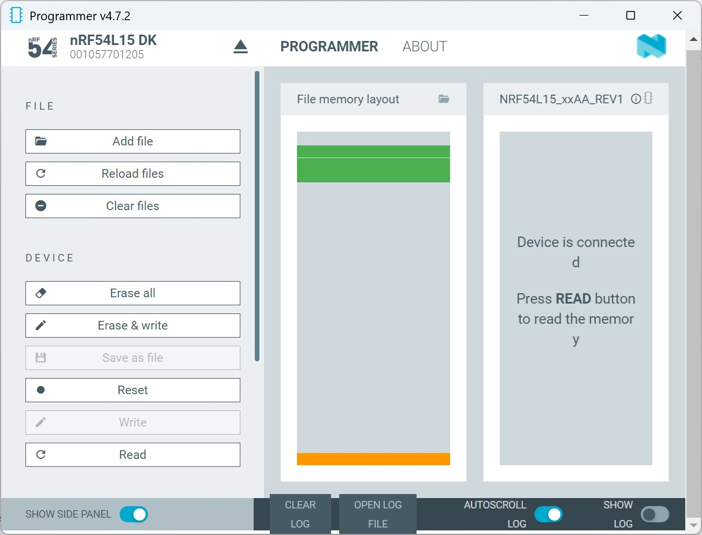
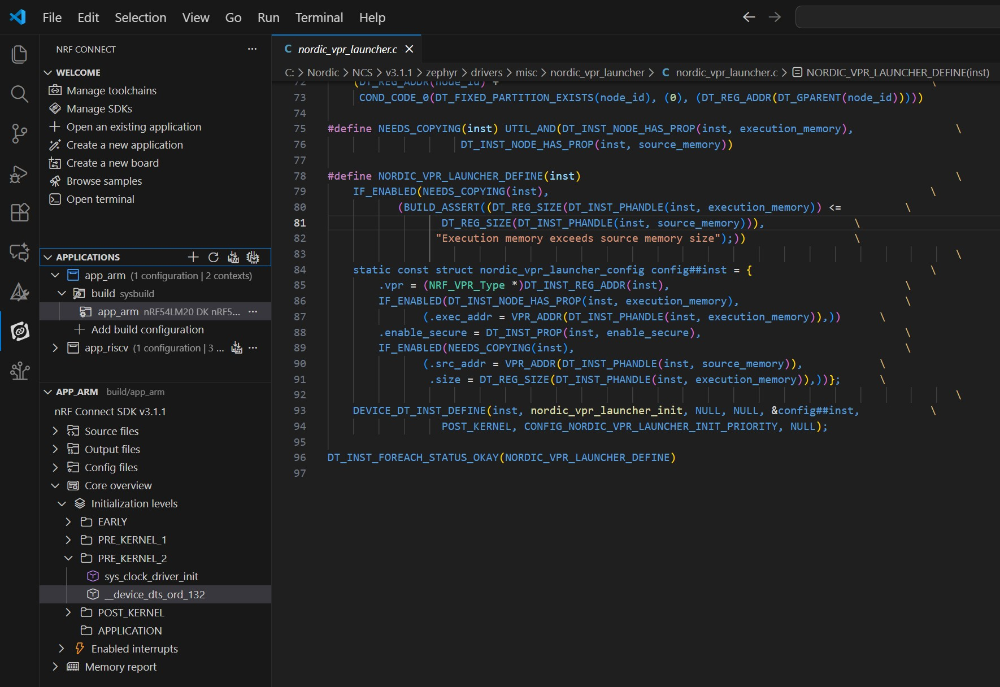
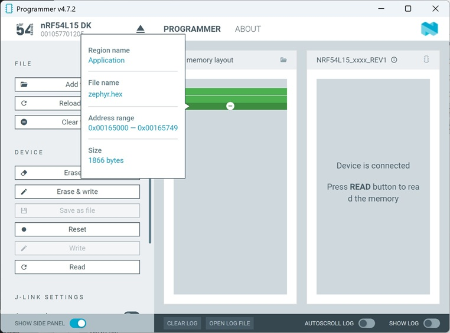
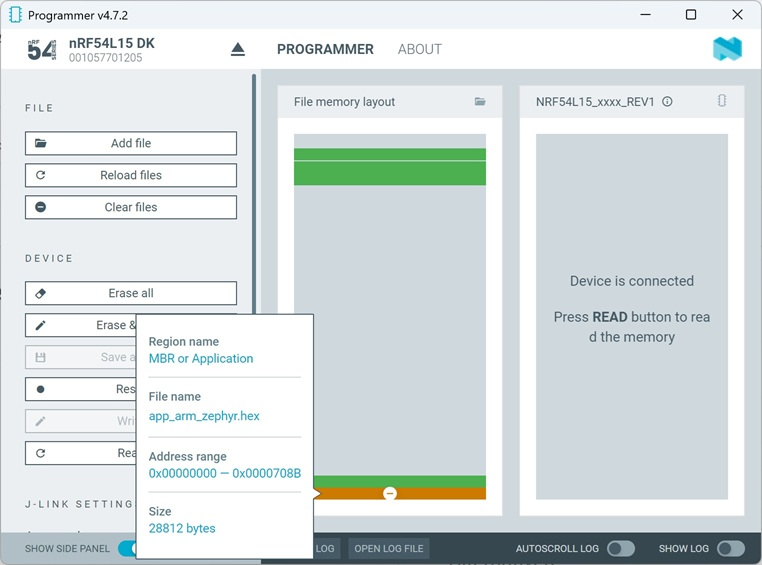
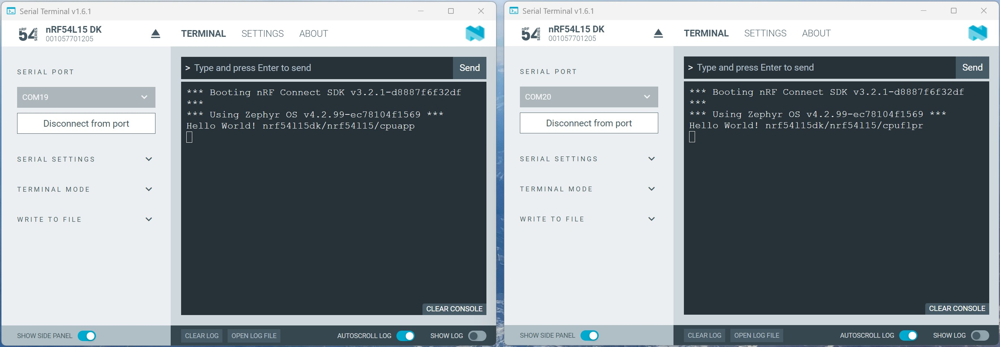

# Running _hello world_ on RISC-V

Let's start with a very simple project. We will use the _hello world_ example from Zephyr and run it on both the ARM Cortex-M33 and the RISC-V 
(on the nRF54L15, this is the FLPR). Since this existing sample also mentions the board target in the debug output, we have an easy way to see 
which CPU executed the code. 

In this hands-on session, I will try to build an understanding of how the individual projects are generally handled — i.e. the ARM Cortex-M33 project and the RISC-V project. 
We will therefore manually download the individual project images to the development kit.  Later, in another hands-on session, we will look at how both projects can be generated and downloaded together using SYSBUILD. 

> __Note:__ This example has been tested with nRF Connect SDK v3.2.1.

## Step-by-Step Description

1) We prepare the directory and file structure. The following directories and files are required:

       hello_world/ 
       │
       ├── app_arm/        <-- Code for ARM Cortex-M33 
       │    ├── CMakeLists.txt 
       │    ├── prj.conf 
       │    │    └── src/main.c
       │
       ├── app_riscv/      <-- Code for RISC-V Core 
       │    ├── CMakeLists.txt 
       │    ├── prj.conf 
       │    │    └── src/main.c

> __NOTE:__ You can copy Zephyr's _hello world_ project (zephyr/samples/hello_world) into folder __app_arm__ and __app_riscv__. 

### Let's first build the RISC-V project

2) Create a project for RISC-V by clicking __+ Open an existing application__ in Visual Studio Code under nRF Connect. Select the __app_riscv__ directory there.
3) Now the build configuration must be added to the project. We use the following settings for this:
   > - __Board target:__ nrf54l15dk/nrf54l15/cpuflpr

> __Note:__
> There are two board targets for the RISC-V:
> - nRF54L15DK/nrf54l15/cpuflpr  
>   This is the recommended board target for the RISC-V. Although the code is placed in non-volatile memory, processing is done in SRAM. The ARM Cortex-M33 must therefore first copy the code to the SRAM before the RISC-V can start.
> - nrf54l15dk/nrf54l15/cpuflpr/xip  
>   With this board target, the RISC-V code is executed from non-volatile memory. Copying to SRAM is not necessary here.

4) Then press the "Generate and Build" button.

5) After the build process has run, we see in the <code>app_riscv</code> project that two projects have been created. Namely <code>app_riscv</code> and <code>vpr_launcher</code>. <code>app_riscv</code> is our _hello_world_ project that runs on the RISC-V CPU. The <code>vpr_launcher</code> project runs on the ARM Cortex-M33. It ensures that the RISC-V is started.

   

If you add the file _app_riscv/build/merged.hex_ to the programmer, you can see that code is placed in the lower area as well as in the upper memory area. The <code>vpr_launcher</code> project is located at the bottom, and the <code></cpu>app_riscv</code> project is located above it.  

   
   
6) However, in the next steps, we want to use an ARM Cortex project, and this should start the RISC-V. Therefore, we do not need the <code>vpr_launcher</code> in the RISC-V project. We use the _zephyr.hex_ file, which exclusively contains the RISC-V hello-world project. The zephyr.hex file can be found here:

    app_riscv/build/app_riscv/zephyr/zephyr.hex

> __Note:__ This Intel hex file is also stored in this GitHub repository in the [__Intel-Hex files__](Intel-Hex_files) directory under the name __app_riscv_zephyr.hex__.

### Let's build the ARM Cortex-M33 project

7) Create a project for ARM Cortex-M33 by clicking __+ Open an existing application__ in Visual Studio Code under nRF Connect. Select the __app_arm__ directory there.
8) Now the build configuration must be added to the project. We use here the following settings for this:
   > - __Board target:__  nrf54l15dk/nrf54l15/cpuapp
   > - __Snippets:__ nordic_flpr

> __Note:__
> By selecting the snippet _nordic-flpr_, the required VPR launcher is integrated into the project. When selecting the snippet, it is important to choose the appropriate solution that was also used in the RISC-V project. In other words, choose between RISC-V code execution in SRAM (_nordic-flpr_) or in non-volatile memory (_nordic-flpr-xip_).

9) Then press the "Generate and Build" button.
10) We have now generated the Intel Hex file for the ARM Cortex-M33. We can find it in the following build directory:

    app_arm/build/app_arm/zephyr/zephyr.hex

> __Note:__ This Intel hex file is also stored in this GitHub repository in the [__Intel-Hex files__](Intel-Hex_files) directory under the name __app_arm_zephyr.hex__.

## Testing

### Check when VPR_Launcher is executed

As described above, we used the __nordic-flpr__ snippet to include the vpr_launcher code into the ARM Cortex-M33 project. Here, we will check when this code is executed. 

11) The __nRF Connect__ Visual Studio Code extension allows us to view the initialization levels in the __Details__ section under __Core overview__. This shows which threads are started during Zephyr RTOS start-up. Various levels (EARLY, PRE_KERNEL_1, PRE_KERNEL_2, POST_KERNEL, or APPLICATION) are listed here. First, we select the __app_arm__ build in __app_arm__ project. __Under Core overview__, we open __PRE_KERNEL_2__. Now we click on ____device_dts_ord_132__. This opens the file with the corresponding thread that is executed here. In our example, the VPR_launcher code opens.

   

### Download both Intel Hex files to the nRF54L15DK dev kit

12) Use the __Programmer__ tool from nRF Connect from Desktop and add both zephyr.hex files in the programmer. Then press __Erase & write__.

    - Add _app_riscv zephyr.hex_ file to programmer:
      
         

     We can see here that the RISC-V code is loaded into the upper memory area. It starts at address 0x0016574C.

    - Now, let's add _app_arm_zephyr.hex_ file to programmer:
   
      

    The code for the ARM Cortex-M33 starts at address 0x00000000, which is the start address of the ARM code. 

### Check response with Serial Terminal

13) Open twice the __Serial Terminal__ and connect both to the nrf54l15. However, select different COM ports.
14) You may have to press the RESET button on your dev kit. You should see in both Terminals the "Hello World!" message followed by the board target name. 

   
  
Since the _hello world_ project not only outputs the “Hello world” string, but also the board target name, we can see here which CPU the message is coming from. <code>cpuapp</code> is the output from the ARM Cortex-M33, and <code>cpuflpr</code> is the output from the RISC-V CPU. 
