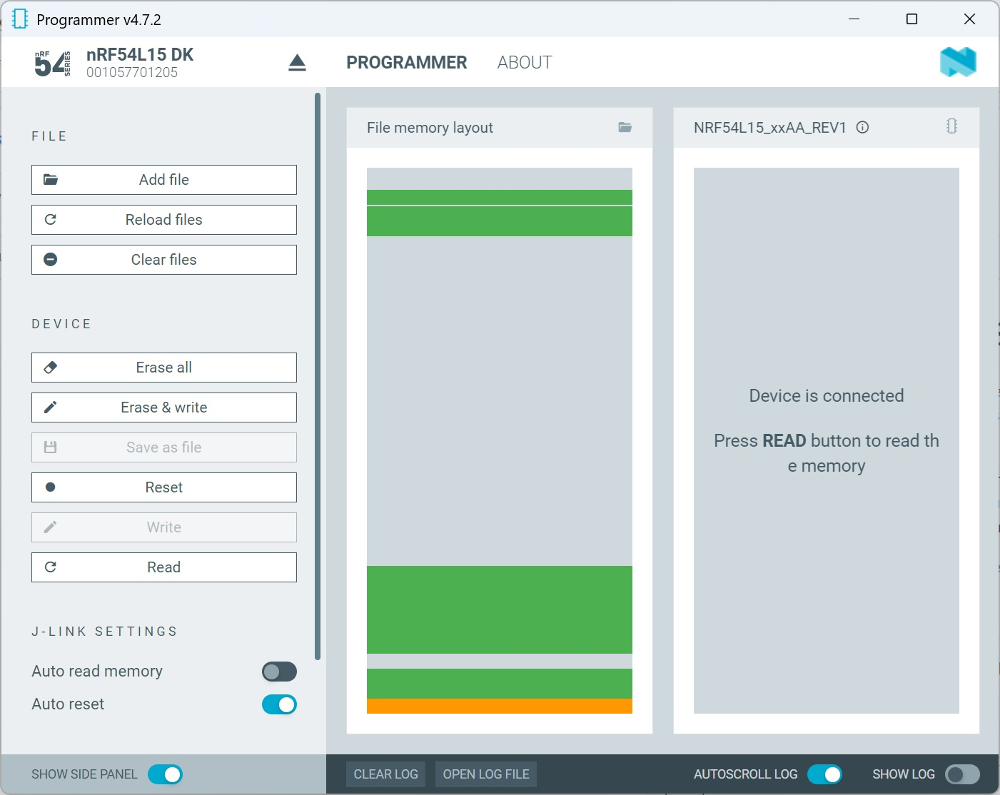
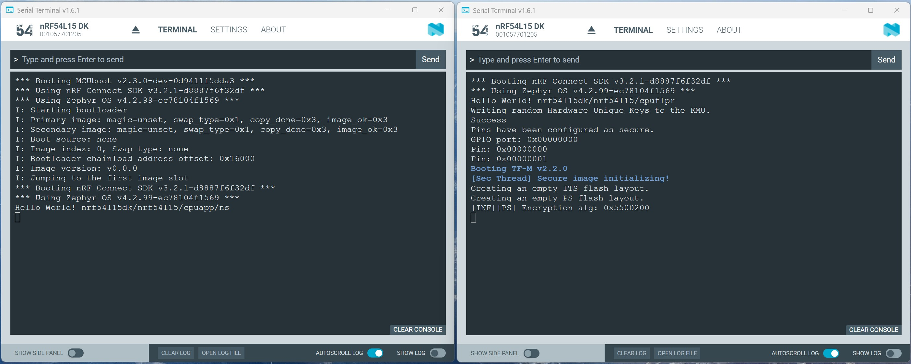

# Running _hello world_ on RISC-V in Non-Secure Trustzone Domain

TrustZone is typically used in a project by placing the bootloader in the Secure domain and running the application itself in the Non-Secure domain. We did not take this into account in the previous hands-on and placed the complete code in Secure domain. In this hands-on, we would now like to place the bootloader in the Secure domain. The ARM Cortex code and the RISC-V code are placed in the Non-Secure domain.

> __Note:__ This example has been tested with nRF Connect SDK v3.2.1.

## Step-by-Step Description

In this hands-on session, we will again work with two separate projects, namely <code>app_arm</code> and <code>app_riscv</code>. In the [previous hands-on](../01_hello_world), we already created the <code>app_riscv</code> application. Since this hands-on does not require any changes to the RISC-V project, we will use the Intel hex file generated in the previous course. All we need to do here is make an adjustment to the ARM Cortex project. 

1) Make a copy of the [previous <code>app_arm</code>](../01_hello_world/app_arm) project.

### Let's build the ARM Cortex-M33 project

2) Create a project for ARM Cortex-M33 by clicking __+ Open an existing application__ in Visual Studio Code under nRF Connect. Select the <code>app_arm</code> directory there.
3) Now the build configuration must be added to the project. We use here the following settings for this:
   > - __Board target:__  nrf54l15dk/nrf54l15/cpuapp/ns
   > > __Note:__ In this hands-on, the code must be placed in the Non-Secure Trustzone domain. Therefore, we select the __.../cpuapp/ns__ board target here.
   > - __Snippets:__ nordic_flpr

> __Note:__ Since we still want to adjust the project, there is no need to do a complete build at this point. We can therefore select the _Generate only_ check box in the __Add Build Configuration__ window.

4) Then press the "Generate and Build" button.

5) So far, we have been working with the default settings for both the memory partition and the VPR (RISC-V) settings. We will continue to work with the default settings for the memory partition. However, we need to adjust the VPR settings. The VPR of the nRF54L series is treated like a peripheral module. This applies in particular to the ARM Cortex-M33 Trustzone handling. VPR can be placed either in the Secure domain or the Non-Secure domain. This is defined via the VPR DeviceTree settings. The default definition was made so that VPR is located in the Secure domain. We will now change this by adding the following DeviceTree overlay file to our project. Add following lines in the file _nrf54l15dk_nrf54l15_cpuapp_ns.overlay_:

      &cpuflpr_vpr {
          /delete-property/ enable-secure;
      };

  > __Note:__ __enable-secure__ is a boolean property. This means that if the symbol __enable-secure__ is listed in the _cpuflpr_vpr_ node, this property is set to true. If the property is not listed, it corresponds to false. Since we want to set __enable-secure__ to false here, we remove it using <code>/delete-property/</code>.

6) We also need to consider the code in the Secure Domain. In this hands-on, we will simply use the most typical case. We will add MCUboot to our project. To do this, we will create the file __sysbuild.conf__ in our project directory and add the following line to this file:

      SB_CONFIG_BOOTLOADER_MCUBOOT=y

7) Now let's do a pristine build. 

8) We have now generated the Intel Hex file for the ARM Cortex-M33 and MCUboot. The opcode for these two projects has already been merged and can be found here::

    app_arm/build/merged.hex

> __Note:__ This Intel hex file is also stored in this GitHub repository in the [__Intel-Hex files__](Intel-Hex_files) directory under the name __app_arm_merged.hex__.

## Testing

### Download both Intel Hex files to the nRF54L15DK dev kit

9) Use the __Programmer__ tool from nRF Connect from Desktop and add both image files in the programmer. Then press __Erase & write__.

    - Add _app_riscv_zephyr.hex_ file to programmer. We can see here that the RISC-V code is loaded into the upper memory area. It starts at address 0x00165000.

    - Now, let's add _app_arm_merged.hex_ file to programmer. There are two blocks. The MCUboot block starts at address 0x00000000. The _hello_world_ code for the ARM Cortex-M33 starts at address 0x00016000. 

   

### Check response with Serial Terminal

13) Open twice the __Serial Terminal__ and connect both to the nrf54l15. However, select different COM ports.
14) You may have to press the RESET button on your dev kit. 

   

   The left terminal window first displays the entire MCUboot output. The last log message from MCUboot is “I: Jumping to the first image slot,” which means that the _hello_world_ application is running. The _hello_word_ application also outputs the name of the board target. Here we can see that this output comes from the ARM Cortex-M33 Non-Secure Trustzone domain.

   The first lines of the right terminal window show the _hello_world_ output generated by the RISC-V. Additional output from the Trusted Firmware-M (TF-M) is then displayed, as it uses the same virtual interface as the RISC-V.